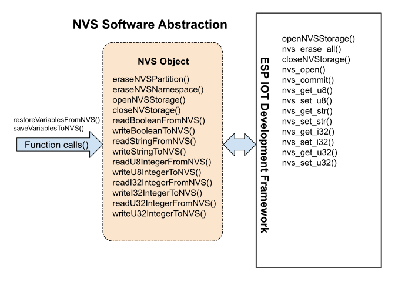

# NVS Abstractions
The system class in itself is a mid-level class in our project.  The intent of the NVS class is to save all other objects from code duplication.
___  

___  
## Top-Level
When in operation, this class becomes an extension of other classes.  So, the top-level abstraction is held in the calling class.  The top level classes call **save / restore functions**.
___  
## Mid-Level
* Opens and closes nvs storage.
* Responsible for erasing partitions and namespaces.
* Makes sure that any value not previously written, is populated with the correct default value.
* Disallows a value to be written twice if the stored value already matches a new value.

Here, we expose our interface with **write / read functions**.
___  
## Low-Level
The system will make calls directly back to the ESP-IDF.  There are no other intermediary actors between NVS and the IDF.

You will notice that the IDF exposes NVS with **set / get functions**.
___  