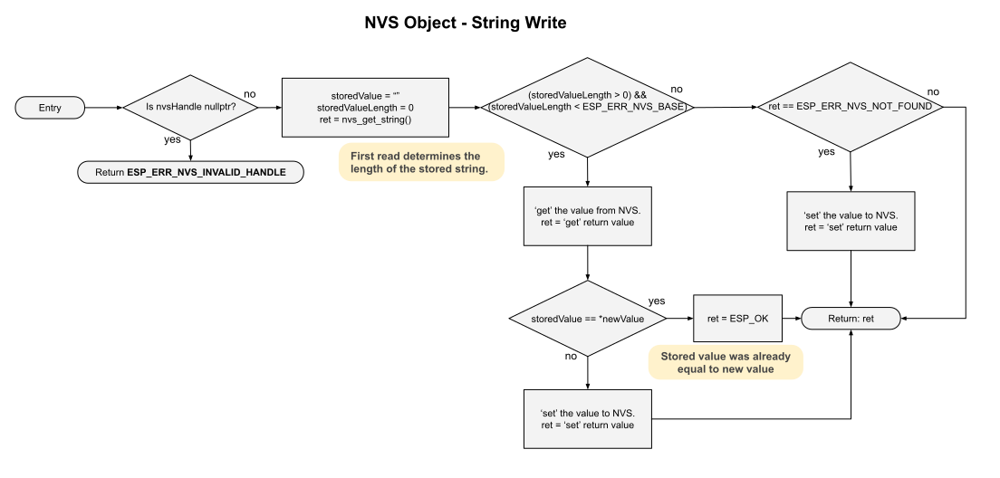

# NVS Flowcharts
This NVS object is a mid-level handler for storage.  This object is an extension for any other object that calls to it.

It abstracts away the lower level ESP-IDF functions into a more generalized call.  We have several purposes encapsulated in these functions:

1) If NVS storage does not exist in FLASH, this object will establish it.
2) If any particular value does not exist in NVS, it uses the default value from the caller (by ref) to set the intial value in NVS.  All read and write calls do pass in the default value by reference.
3) All write function calls 'get' before a 'set'.  If those values already equal, another 'set' is does not occur.

This is the Read function for boolean values.  Default value is passed in by reference and any retrieved value is passed back by reference.

___  
This is the Write function for boolean values.  Value is passed in by reference.

___  
This is the Read pattern for integers.  Default value is passed in by reference and any retrieved value is passed back by reference.

___  
This is the Write pattern for integers.  Value is passed in by reference.

___  
This is the Read function for strings.  Default value is passed in by reference and any retrieved value is passed back by reference.

___  
This is the Write function for string.  Value is passed in by reference.

___  